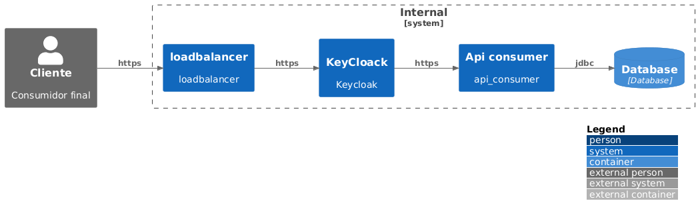

# Movie Awards

## Requisitos

Todos os requisitos da aplicação podem ser encontrados no arquivo `Requisitos.md`.

## Tecnologias
- Java 21
- quarkus
- maven
- Mockito
- JUnit 5
- H2 Database
- Swagger-UI

## Funcionamento
- Dentro da pasta resources existem os arquivos movies.csv que podem ser substuídos dentro do seu profile para testes da aplicação.
- A aplicação em seu bootstrap lê o arquivo csv, carrega no banco de dados em memória, que quando é desligado é perdido.
- Todas as configurações da aplicação estão no arquivo `application.properties` dentro da pasta `src/main/resources`, onde existem pequenas alterações para o profile de dev

## Dúvidas sobre negócio
- Esta se assumindo que o arquivo pode NÃO estar no formato correto, portanto a aplicação não irá iniciar.
- Existe a possibilidade de que em algum ano não exista vencedor, a lista vai retornar vazia.
- Da mesma forma se existirem dois ganhadores no mesmo ano serão considerados.
- Conforme o solicitado, a api está respeitando os principios de Richardson nivel 2 apenas no endoint disponibilizado, não dando suporte a alterações.
- Foi considerado que SEMPRE existirá um cabeçalho no arquivo CSV, portanto a leitura do arquivo não irá falhar por conta disso.
- Quando existir apenas linhas sem registros de campeão, será desconsiderado.

## Considerações
- Como é uma API aparentemente interna, estou considerando a camada de segurança a nível de rede, sem autenticação.

## Melhorias

- Implementação da autenticação se houver necessidade
- Adição de um framework de migração de database com controles de idempotência, como (FlyWay, Liquibase)
- Substituição do banco de dados em memoria por um banco de dados (onde podemos indexar os campos necessários) e termos uma performance muito maior para altos volumes de dados.
- Substuituição das configurações adicionadas ao arquivo de properpeties, por variáveis de ambiente, que facilitará a utilização emambientes diferentes e também a utilização de cofres de chaves
- Implementação de praticas de observabilidade com micrometer, prometheus e grafana
- Utilização de RateLimit e cache para melhorar a performance da aplicação
- Versionamento da API para futuras alterações mantendo assim a compatibilidade.

## Diagrama da aplicação

